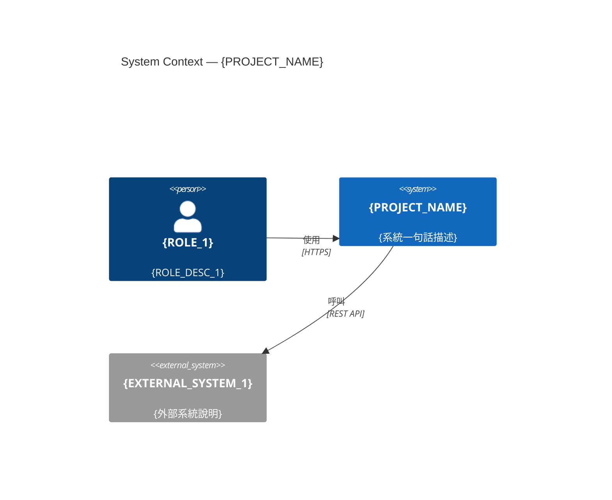
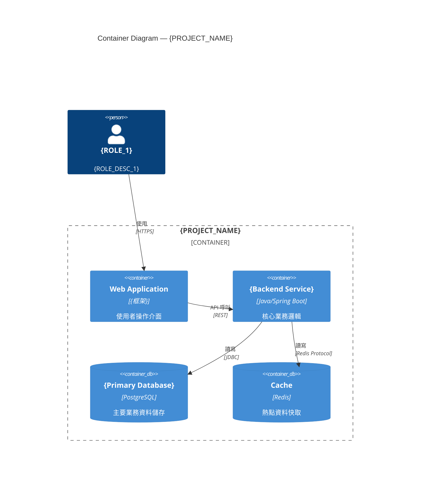
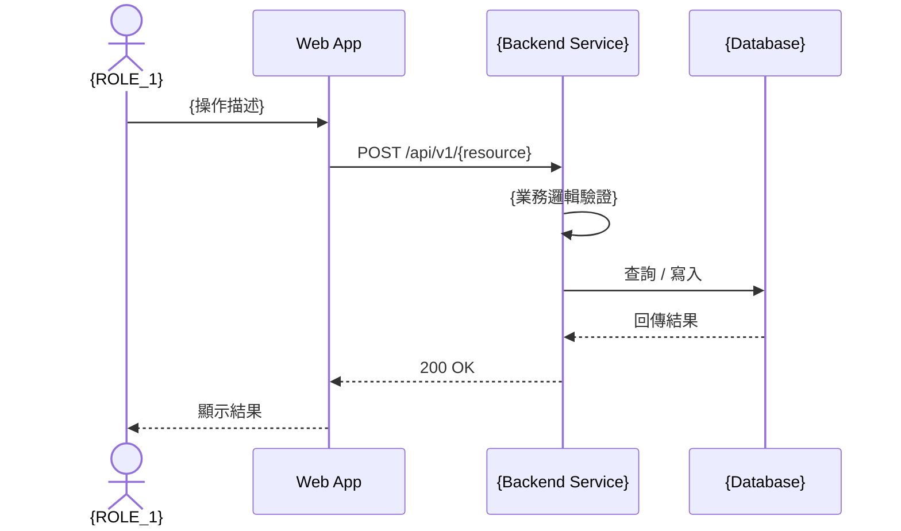

# 功能規格文件 (Functional Specification Document)

**文件編號：** FSD-{PROJECT_CODE}-{VERSION}
**專案名稱：** {PROJECT_NAME}
**版本：** {VERSION}　**建立日期：** {DATE}　**最後更新：** {LAST_UPDATED}
**文件狀態：** 草稿 / 審查中 / 核准

---

## 文件修訂紀錄

| 版本 | 日期 | 修訂人 | 修訂說明 |
|------|------|--------|----------|
| 0.1  | {DATE} | {AUTHOR} | 初稿建立 |

---

## 1. 文件目的與範圍

### 1.1 目的
本文件旨在描述 **{PROJECT_NAME}** 系統的功能需求，作為開發、測試與業務單位之間的溝通基礎。

### 1.2 範圍
- {SCOPE_ITEM_1}

### 1.3 不在範圍內
- {OUT_OF_SCOPE_1}

---

## 2. 名詞定義與縮寫

| 名詞 / 縮寫 | 說明 |
|------------|------|
| FSD | Functional Specification Document，功能規格文件 |
| {TERM_1} | {DEFINITION_1} |

---

## 3. 參考文件

| 文件名稱 | 版本 | 說明 |
|----------|------|------|
| 需求訪談紀錄 | {VERSION} | 業務需求來源 |

---

## 4. 系統概述

### 4.1 系統背景
{描述系統的業務背景}

### 4.2 系統目標
1. {GOAL_1}

### 4.3 使用者族群

| 使用者角色 | 說明 | 主要使用功能 |
|-----------|------|-------------|
| {ROLE_1} | {ROLE_DESC_1} | {FEATURES_1} |

---

## 5. 系統架構圖（C4 Model）

> 圖形一律使用 **Mermaid**，可直接在 GitHub / VS Code 預覽。

### 5.1 C4 L1 — System Context Diagram



### 5.2 C4 L2 — Container Diagram



**Container 清單：**

| Container | 技術選型 | 職責 |
|-----------|---------|------|
| {Backend Service} | {框架} | 核心業務邏輯 |

---

## 6. 業務流程循序圖

### 6.1 {核心流程一}（對應 FR-{MODULE}-{N}）



**例外情境：**
- {業務驗證失敗} → 回傳 422，顯示 {ERROR_MESSAGE}

---

## 7. 功能需求

> 每個功能項目依 **FR-{模組代碼}-{序號}** 編號。

### 7.1 {模組名稱一}

#### FR-{MODULE1}-001：{功能名稱}

- **優先等級：** 高 / 中 / 低
- **需求來源：** {來源文件或訪談紀錄}
- **功能描述：** {詳細說明此功能的用途與行為}
- **前置條件：** {PRE_CONDITION_1}
- **主要流程：**
  1. 使用者執行 {ACTION_1}
  2. 系統回應 {RESPONSE_1}
- **替代流程：** 若 {CONDITION}，則 {ALTERNATIVE_FLOW}
- **例外處理：** 若 {ERROR_CONDITION}，系統顯示 {ERROR_MESSAGE}
- **驗收標準：**
  - [ ] {ACCEPTANCE_CRITERIA_1}

---

## 8. 非功能需求

### 8.1 效能需求

| 指標 | 目標值 |
|------|--------|
| API 回應時間 | ≤ 500 ms |

### 8.2 安全性需求
- 所有 API 須實作身份驗證
- 敏感資料傳輸須使用 TLS 1.2 以上

### 8.3 可用性需求
- 系統可用性：{AVAILABILITY}%

### 8.4 相容性需求

| 類別 | 規格 |
|------|------|
| 瀏覽器支援 | Chrome / Edge / Firefox 最新版 |

---

## 9. 使用者介面需求

### 9.1 設計原則
- 符合公司 UI/UX 規範、RWD、WCAG 2.1 AA

### 9.2 畫面清單

| 畫面 ID | 畫面名稱 | 說明 | 關聯功能 |
|---------|---------|------|---------|
| SCR-001 | {SCREEN_NAME} | {SCREEN_DESC} | {RELATED_FR} |

---

## 10. 資料需求

### 10.1 主要資料實體

| 實體名稱 | 說明 | 關聯實體 |
|---------|------|---------|
| {ENTITY_1} | {DESC} | {RELATED} |

### 10.2 資料保留政策
- 交易紀錄：保留 {RETENTION_PERIOD} 年

---

## 11. 整合需求

| 系統名稱 | 整合方式 | 資料方向 | 說明 |
|---------|---------|---------|------|
| {SYSTEM_1} | REST API | 輸入 | {DESC} |

---

## 12. 限制與假設

### 12.1 限制條件
- {CONSTRAINT_1}

### 12.2 假設前提
- {ASSUMPTION_1}

---

## 13. Gherkin 測試案例

### 13.1 Gherkin 撰寫規範
- **Feature**：對應功能模組，一個模組一個 `.feature` 檔
- **Scenario**：對應單一業務情境（正常流程、替代流程、例外情境各自獨立）
- **Given/When/Then/And/But**：標準 Gherkin 語法
- **Scenario Outline + Examples**：用於多組資料驗證的參數化情境

### 13.2 {模組名稱一} Feature

**檔案：** `sdlc/fsd/output/features/{MODULE1_CODE}-{feature-name}.feature`

```gherkin
# language: zh-TW
@{module_tag} @{priority_tag}
Feature: {模組功能名稱}
  作為 {使用者角色}
  我希望能夠 {功能目的}
  以便 {業務價值}

  # 對應 FR-{MODULE1}-001 正常流程
  @smoke @happy-path
  Scenario: {正常情境名稱}
    Given {前置條件描述}
    When 使用者 {執行動作}
    Then 系統應 {預期回應}

  # 對應 FR-{MODULE1}-001 例外情境
  @regression @error-handling
  Scenario: {例外情境名稱}
    Given {前置條件描述}
    When 使用者 {觸發例外的動作}
    Then 系統應顯示錯誤訊息 "{ERROR_MESSAGE}"

  # 邊界值驗證
  @regression @boundary
  Scenario Outline: {參數化情境名稱}
    Given {前置條件}
    When 使用者輸入 "<{欄位名稱}>"
    Then 系統應回應 "<預期結果>"

    Examples:
      | {欄位名稱} | 預期結果 |
      | {VALUE_1}  | {RESULT_1} |
      | {邊界值}   | {邊界結果} |
```

### 13.3 Gherkin 標籤規範

| 標籤 | 用途 | 執行時機 |
|------|------|---------|
| `@smoke` | 冒煙測試核心情境 | 每次部署後立即執行 |
| `@regression` | 完整迴歸測試情境 | 每日 CI / 版本發布前 |
| `@happy-path` | 正常流程情境 | 含於 smoke |
| `@error-handling` | 例外與錯誤情境 | 含於 regression |
| `@boundary` | 邊界值測試 | 含於 regression |
| `@wip` | 開發中，暫不執行 | 排除於 CI |

### 13.4 Feature 清單

| Feature 檔案 | 對應模組 | Scenario 數 | 對應 FR |
|-------------|---------|------------|--------|
| `{MODULE1_CODE}-{name}.feature` | {模組一} | {N} | {FR_IDS} |

---

## 14. 審查與核准

| 角色 | 姓名 | 簽核日期 | 備註 |
|------|------|---------|------|
| 業務需求方 | {NAME} | {DATE} | |
| 產品負責人 | {NAME} | {DATE} | |
| 技術主管 | {NAME} | {DATE} | |
| 品保主管 | {NAME} | {DATE} | |

---

*本文件由 GitHub Copilot `generate-fsd` Skill 產生，版本控制請參考 Git 歷史紀錄。*
