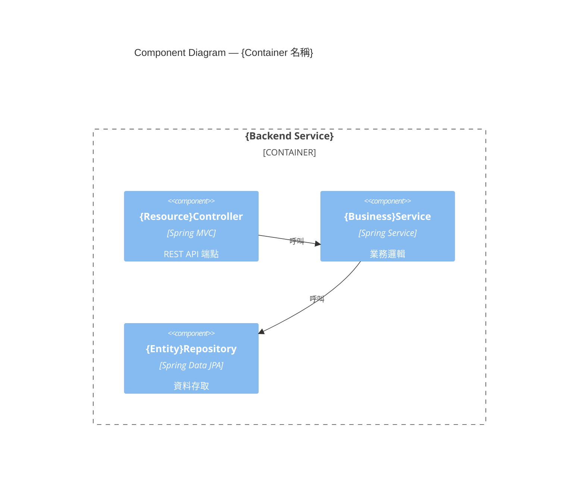
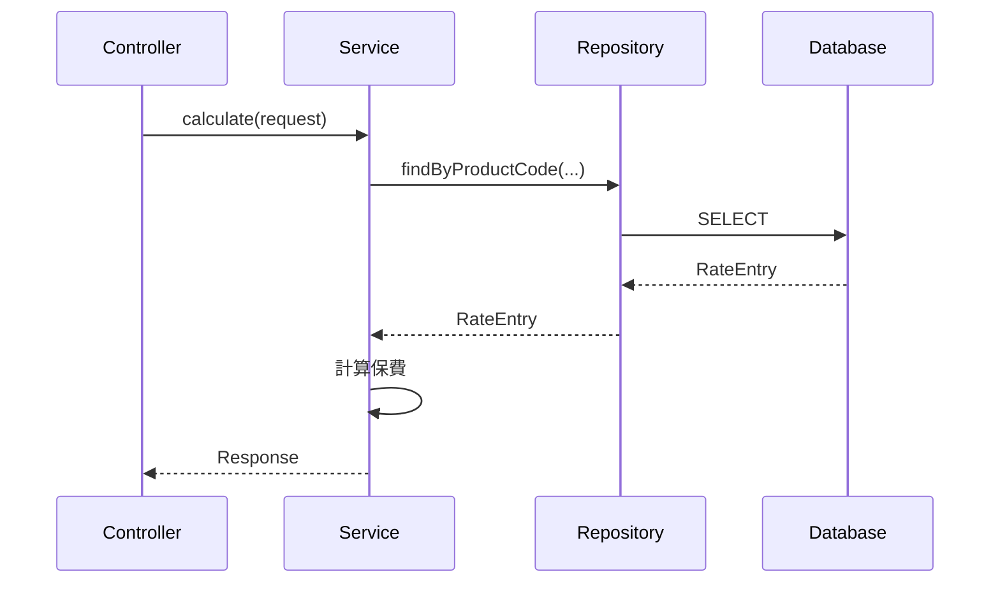

# 系統設計文件 (System Design Document)

**文件編號：** SD-{PROJECT_CODE}-{VERSION}　**專案名稱：** {PROJECT_NAME}
**版本：** {VERSION}　**建立日期：** {DATE}　**對應 FSD：** FSD-{PROJECT_CODE}-{FSD_VERSION}

---

## 1. 文件目的
本文件描述 {PROJECT_NAME} 的技術實作設計，作為開發團隊產出程式碼的直接依據。

## 2. 參考文件

| 文件名稱 | 版本 |
|----------|------|
| FSD-{PROJECT_CODE}-{VERSION} | {VERSION} |

## 3. 架構概觀

### 3.1 架構風格
{描述整體架構風格，如 Modular Monolith / Microservices，依 ADR-0001 決定}

### 3.2 技術標準宣告

> ⚠️ 本節為 `springboot-codegen` 唯一的 package 命名依據，**必須明確填寫**。

| 項目 | 值 |
|------|-----|
| **Package Root** | `{com.company.projectcode}` |
| Java 版本 | {JAVA_VERSION} |
| Spring Boot 版本 | {SPRING_BOOT_VERSION} |

### 3.3 ADR 索引

| ADR | 決策主題 | 狀態 |
|-----|---------|------|
| [ADR-0001](../../adr/output/ADR-0001-架構風格.md) | 架構風格 | {Proposed/Accepted} |
| [ADR-0002](../../adr/output/ADR-0002-後端框架.md) | 後端框架 | {Proposed/Accepted} |

---

## 4. C4 L3 元件圖



## 5. 技術層循序圖



## 6. 模組設計

| 模組 | 依賴 | 對應 FR |
|------|------|--------|
| {Module 1} | {Module 2} | {FR_IDS} |

## 7. 資料設計

### 7.1 ER 概述
{描述實體關聯}

### 7.2 資料表定義

#### {Entity 名稱}

| 欄位 | 型別 | 約束 | 說明 |
|------|------|------|------|
| id | UUID | PK | 主鍵 |
| {field} | {type} | {constraint} | {desc} |

**索引：** {INDEX_LIST}
**快取策略：** {CACHE_STRATEGY，例：Cache-Aside，TTL=1hr}

## 8. API 設計

### 8.1 API 清單

| Method | Path | 說明 | 權限 |
|--------|------|------|------|
| POST | /api/v1/{resource} | {desc} | {ROLE} |

### 8.2 Request/Response Schema

```json
{
  "field1": "string",
  "field2": 0
}
```

### 8.3 錯誤碼表

| HTTP 狀態碼 | 錯誤碼 | 說明 |
|------------|--------|------|
| 400 | VALIDATION_ERROR | 欄位驗證失敗 |
| 404 | RESOURCE_NOT_FOUND | 資源不存在 |
| 422 | BUSINESS_RULE_VIOLATION | 業務規則驗證失敗 |

## 9. 安全設計

- 認證方式：{JWT/OAuth2}
- RBAC 角色矩陣：{ROLE_MATRIX}

## 10. 部署架構

- 環境清單：{dev/test/prod}
- 容器化：{Docker/K8s}
- CI/CD：{PIPELINE_DESC}

## 11. 可觀測性
- 監控指標：{METRICS}

## 12. 效能與快取策略
- {CACHE_STRATEGY_DETAIL}

## 13. 錯誤處理策略
- 統一由 `GlobalExceptionHandler` 攔截，回傳標準 `ApiResponse` 格式

---

*本文件由 GitHub Copilot `generate-sd` Skill 產生。*
