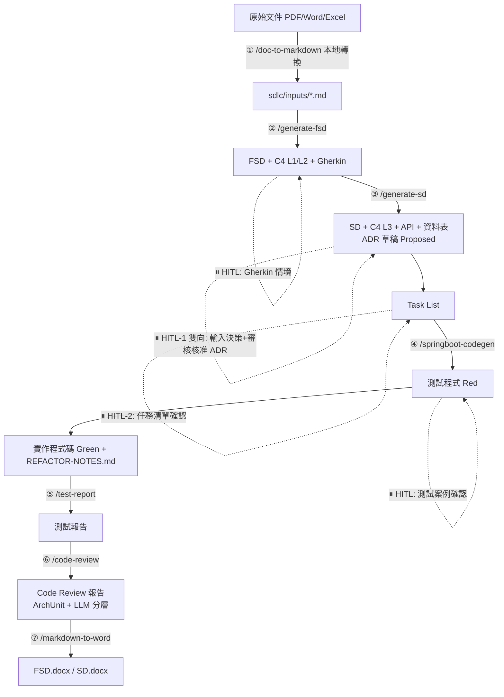

# sdlc-demo-copilot

以「壽險新保件保費試算（Life Premium）」為 MVP，端對端驗證 **GitHub Copilot Skills** 驅動的 SDLC 自動化工作流程：
從需求文件到可執行的 Spring Boot 程式碼，全程由 `.github/skills/` 下的 7 個 Copilot Skill 驅動，關鍵節點由人工確認（HITL）。

本專案採用 **VS Code / GitHub Copilot Agent Skills** 開放標準（`.github/skills/<name>/SKILL.md`），
將 SDLC 各階段（需求 → FSD → SD/ADR → TDD/BDD 程式碼 → 測試報告 → Code Review → Word 交付）
封裝為 7 個可重複使用的 Skill，並以壽險保費試算案例完整跑過一次流程以驗證可用性。

## Skills 是什麼？原理與設計（給初學者）

### 1. 什麼是一個「Skill」？

一個 Skill 就是 `.github/skills/<skill-name>/SKILL.md` 這樣一個 Markdown 檔案，內含：

```markdown
---
name: generate-fsd                # Skill 的識別名稱，對應斜線指令 /generate-fsd
description: '根據需求文件產出 FSD...'  # 一句話說明「何時該用這個 Skill」
argument-hint: '#需求文件.md'       # 呼叫時建議帶的參數提示
---

# 這裡開始是完整的執行步驟（Step-by-step Procedure）...
```

Copilot 會拿使用者輸入的意圖，去跟每個 Skill 的 `description` 做語意比對；比對到就自動載入該 Skill 的完整內容，
或是使用者也可以直接打 `/skill-name` 手動指定要用哪個 Skill。

### 2. 為什麼要設計成 Skill，而不是把所有規則塞進一個大提示詞？

因為 Copilot 每次對話能塞進去的內容（context window）有限，塞太多不相關規則只會浪費 token、稀釋重點。
Skill 的核心設計原則是**漸進式揭露（Progressive Disclosure）**：只在真正需要時才載入對應內容，分三層：

```
Session 啟動
    │
    ▼ 第 1 層｜索引層（每個 Skill 只花 ~100 tokens）
   只讀取每個 SKILL.md 的 name + description，用來判斷「這次任務該用哪個 Skill」
    │
    │  使用者輸入語意匹配到某個 description，或直接輸入 /skill-name
    ▼ 第 2 層｜指令層（< 5000 tokens）
   載入該 Skill 完整的 SKILL.md 內文（完整工作流程、步驟、HITL 確認點）
    │
    │  只有 SKILL.md 內文明確指向時才繼續載入
    ▼ 第 3 層｜資源層（按需載入，用多少載多少）
   references/{template}.md（範本、樣式指南、程式碼範本）
   scripts/{tool}.py（可直接執行的工具程式，例如文件轉換腳本）
   assets/（樣板檔案，例如公司 Word 範本 .docx）
```

也就是說：**平常只花 100 tokens 判斷要不要用某個 Skill，真正要用才花費完整內文的 token**，
需要範本或腳本時才再多載入一點——這讓專案可以塞下大量規則細節，卻不會拖垮每次對話的效率。

### 3. 專案規範怎麼共用給所有 Skill？

分層規則之外，還有一份 [.github/copilot-instructions.md](.github/copilot-instructions.md)，
內容是 Java 命名規範、分層依賴規則等**每次 session 都會自動載入**的強制標準，
所有 Skill 產出程式碼時都必須遵守；若與個別 `SKILL.md` 內文衝突，以這份檔案為最終依據。

### 4. 本專案的 7 個 Skill，各自負責什麼？

| Skill | 一句話定位 |
|-------|-----------|
| [`doc-to-markdown`](.github/skills/doc-to-markdown/SKILL.md) | 把 PDF/Word/Excel/PPT 原始文件在本機轉成 Markdown，不上雲端 |
| [`generate-fsd`](.github/skills/generate-fsd/SKILL.md) | 需求文件 → 功能規格文件（FSD）+ C4 L1/L2 圖 + Gherkin BDD 情境 |
| [`generate-sd`](.github/skills/generate-sd/SKILL.md) | FSD → 系統設計文件（SD）+ C4 L3 圖 + API/資料表設計 + ADR + Task List |
| [`springboot-codegen`](.github/skills/springboot-codegen/SKILL.md) | Task List + SD + Gherkin → 依 TDD/BDD（Red→Green→Refactor）產出 Spring Boot 程式碼 |
| [`test-report`](.github/skills/test-report/SKILL.md) | 彙整 surefire/cucumber/jacoco 原始報告為統一格式中文測試報告 |
| [`code-review`](.github/skills/code-review/SKILL.md) | ArchUnit 驗結構規則、LLM 只審業務語意與資安意圖，降低 token 消耗 |
| [`markdown-to-word`](.github/skills/markdown-to-word/SKILL.md) | 用 Pandoc 套公司樣板，把 FSD/SD 的 Markdown 轉成交付用 .docx |

想看每個 Skill 更詳細的設計理念（含 Kiro → Copilot 的對照與移植決策），請見 [SKILL-DESIGN.md](SKILL-DESIGN.md)。

### 5. 兩個關鍵的「省 Token」設計：docling 與 ArchUnit

前面提到的漸進式揭露只解決了「載入 Skill 說明」的 token 消耗，但**執行 Skill 過程中**還有兩個更燒 token 的環節，
本專案分別用 docling 和 ArchUnit 這兩個「確定性工具」取代 LLM，把 LLM 留給真正需要判斷力的工作：

#### (1) docling — 把「讀文件」這件事從 LLM 手上拿走

`doc-to-markdown` Skill 面對的問題：原始需求文件常常是 PDF、Word、Excel、PPT。
如果直接把整份 PDF 丟給 LLM 讀取，會發生兩個問題：

- **Token 爆炸**：PDF 內的表格、版面、圖片都要先被模型「看懂」再轉換成文字理解，一份幾十頁的規格書
  可能吃掉數萬 token，而且每次重新分析都要再燒一次。
- **機密外洩風險**：若使用雲端 OCR/文件理解 API，文件內容等於上傳到第三方服務。

`docling`（[DS4SD/docling](https://github.com/DS4SD/docling)）是一個**本機執行**的文件結構化解析工具，
專門處理 PDF 的表格、標題階層、版面配置，把 PDF/Word/Excel/PPT 轉成結構清楚的 Markdown（掃描件則走內建 OCR）。
關鍵在於：**這一步完全不需要呼叫 LLM**——docling 是傳統的文件解析程式（規則 + 電腦視覺模型跑在本機），
輸出的 Markdown 檔案這時候才會被後續 `generate-fsd` 等 Skill 讀取。

效果：LLM 只需要讀「已經整理好的 Markdown 純文字」，不用重複花 token 去理解 PDF 版面與圖片；
且文件全程留在本機，不上雲端。詳見 [`.github/skills/doc-to-markdown/SKILL.md`](.github/skills/doc-to-markdown/SKILL.md)。

#### (2) ArchUnit — 把「檢查程式碼結構」這件事從 LLM 手上拿走

`code-review` Skill 面對的問題：程式碼審查裡有一大類規則其實是「機械化、非黑即白」的，例如：

- Controller 不可以直接依賴 Repository（分層依賴方向）
- Service 實作類別命名必須以 `ServiceImpl` 結尾
- package 之間不可以有循環依賴

這類規則若讓 LLM 逐檔案讀程式碼判斷，token 消耗會隨檔案數量線性增加，而且 LLM 的判斷還可能不穩定
（同一份程式碼兩次審查給出不同結論）。

`ArchUnit`（[ArchUnit](https://www.archunit.org/)）是一個 Java 函式庫，可以把「分層依賴」「命名慣例」
「循環依賴」這些架構規則寫成**真正會被 JVM 執行的單元測試**（例如 `ArchitectureTest.java`）。
規則只要寫一次，之後每次 `./mvnw test` 就會用編譯器等級的確定性去驗證，結果永遠一致、不消耗任何 LLM token。

效果：`code-review` Skill 因此設計成兩階段分工——
**Phase 1 結構檢查交給 ArchUnit**（0 token，結果確定），
**Phase 2 才讓 LLM 專注審查 ArchUnit 驗不出來的部分**（業務邏輯正確性、資安意圖、輸入驗證缺漏），
LLM 不必再逐行檢查「Controller 有沒有依賴 Repository」這種可以用程式碼直接證明的事。
詳見 [`.github/skills/code-review/SKILL.md`](.github/skills/code-review/SKILL.md)。

> **共同原則**：能用確定性工具（本機文件解析器、單元測試框架）驗證或轉換的事，就不要讓 LLM 做；
> LLM 的 token 預算應該留給「需要理解語意、無法寫成規則」的判斷，例如業務邏輯是否正確、資安意圖是否合理。

## SDLC 每個步驟所需的 Skills、輸入與輸出

下圖是完整的執行流程，虛線代表需要人工確認才能繼續的 **HITL（Human-in-the-loop）** 關卡：



逐步對照表（照順序執行，前一步的輸出就是下一步的輸入）：

| 步驟 | Skill（斜線指令） | 輸入 | 輸出 | 需要人工確認（HITL）？ |
|------|------------------|------|------|----------------------|
| ① | `/doc-to-markdown` | `sdlc/inputs/raw/*.{pdf,docx,xlsx,pptx}` 原始文件 | `sdlc/inputs/*.md` | 否（本專案需求本身已是 Markdown，此步驟略過） |
| ② | `/generate-fsd` | 需求文件 / User Story / PRD / 既有原始碼 | `sdlc/fsd/output/FSD-{CODE}-v{N}.md` + `*.feature`（Gherkin） | 是：FSD 主體、Gherkin 情境需人工確認 |
| ③ | `/generate-sd` | 上一步的 FSD 文件（+ 既有已核准 ADR） | `sdlc/sd/output/SD-{CODE}-v{N}.md` + `sdlc/adr/output/ADR-NNNN-*.md` + `TASK-LIST-{CODE}-v{N}.md` | 是：HITL-1（雙向，需輸入決策依據 + 審核核准 ADR）、HITL-2（任務清單確認） |
| ④ | `/springboot-codegen` | 上一步的 Task List + SD + Gherkin feature 檔 | `src/` 完整 Spring Boot 程式碼（先產出會失敗的測試 Red，再產出讓測試轉綠的實作 Green）+ `REFACTOR-NOTES.md` | 是：Red 狀態的測試案例需人工確認業務規則/邊界值後才繼續 Green |
| ⑤ | `/test-report` | `./mvnw test` 產出的 surefire / cucumber / jacoco 原始報告 | `sdlc/test/output/TEST-REPORT-{CODE}-v{N}.md` | 否 |
| ⑥ | `/code-review` | `src/` 原始碼 + `.github/copilot-instructions.md` | Code Review 報告（ArchUnit 結構規則 + LLM 語意審查） | 否（發現 Blocker 會自動告警） |
| ⑦ | `/markdown-to-word` | `sdlc/fsd\|sd/output/*.md` | `*.docx` 交付文件 | 否 |

> 全流程共 **5 個 HITL 確認點**，確保 AI 產出的每個關鍵文件（FSD、Gherkin、ADR、Task List、測試案例）都經過人工把關，
> 而非全自動不受控地產生程式碼。實際執行過程與各步驟的驗證結果，請見 [sdlc/README.md](sdlc/README.md)。

## 快速導覽

```
sdlc-demo-copilot/
├── SKILL-DESIGN.md              # GitHub Copilot Skill 完整設計文件（本專案核心交付）
├── .github/
│   ├── copilot-instructions.md  # 開發標準（每次 session 自動載入，對應原 Kiro Steering）
│   └── skills/                  # 7 個 GitHub Copilot Skills
│       ├── doc-to-markdown/
│       ├── generate-fsd/
│       ├── generate-sd/
│       ├── springboot-codegen/
│       ├── test-report/
│       ├── code-review/
│       └── markdown-to-word/
│
├── sdlc/                        # SDLC 文件（需求 → FSD → SD → ADR → Task List → 測試報告）
│   ├── inputs/                  # 原始需求
│   ├── fsd/                     # 功能規格文件 + Gherkin
│   ├── sd/                      # 系統設計文件 + Task List
│   ├── adr/                     # 架構決策紀錄（HITL-1 審核）
│   └── test/                    # 測試報告模板與輸出
│
└── src/                         # Spring Boot 實作（由 /springboot-codegen 產出）
    ├── main/java/com/example/lifepremium/
    └── test/java/com/example/lifepremium/
```

## MVP 案例：壽險保費試算

沿用原 repo 的業務情境與規則（BR-001 ~ BR-005），詳見 [sdlc/inputs/LIFE-PREMIUM-requirements.md](sdlc/inputs/LIFE-PREMIUM-requirements.md)。

## 驗證流程

完整 SDLC 執行紀錄與各 Skill 驗證結果，詳見 [sdlc/README.md](sdlc/README.md)。

## 技術棧

| 項目 | 選型 |
|------|------|
| 語言 | Java 17 |
| 框架 | Spring Boot 3.3 |
| ORM | Spring Data JPA + Hibernate 6 |
| 資料庫（本機/正式） | PostgreSQL 15；測試 Profile 使用 H2 In-Memory |
| 測試 | JUnit 5 + Mockito + Cucumber 7 |
| 架構測試 | ArchUnit 1.3 |
| 覆蓋率 | JaCoCo |
| 文件 | Springdoc OpenAPI 2 |
| 建置 | Maven 3.9（含 Maven Wrapper） |

## 快速開始

```bash
# 執行單元測試
./mvnw test -Dgroups="unit"

# 執行全部測試（含 Cucumber BDD、ArchUnit）
./mvnw test

# 啟動應用程式（測試/本機用 H2，profile=local 對接 PostgreSQL）
./mvnw spring-boot:run -Dspring-boot.run.profiles=test
```
