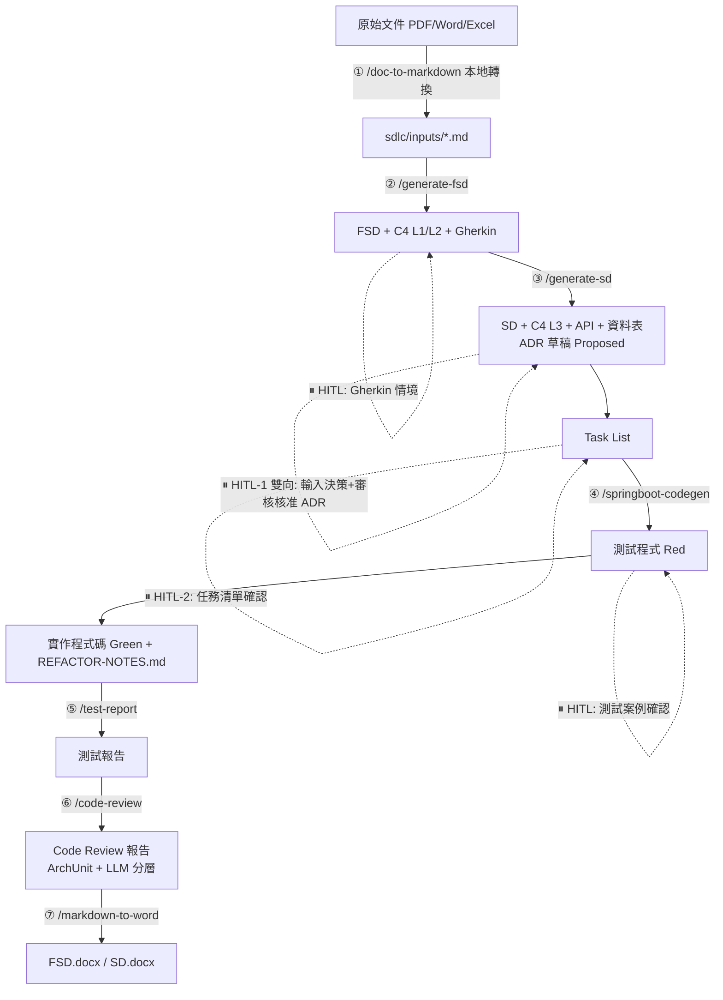

# GitHub Copilot Skill 完整設計文件

> 版本：v1.0　作者：kiro-sdlc → copilot-sdlc 移植　更新日期：2026-09-08
> 參考來源：[ChunPingWang/sdlc-demo-kiro](https://github.com/ChunPingWang/sdlc-demo-kiro)

## 1. 目的

將 `sdlc-demo-kiro` 中以 Kiro Skill 驅動的「需求 → FSD → SD/ADR → TDD/BDD 程式碼 → 測試報告 → Code Review →
Word 交付」SDLC 流程，完整移植為 **GitHub Copilot Agent Skills**（`.github/skills/<name>/SKILL.md`），
使同一套壽險保費試算（Life Premium）案例可在 VS Code + GitHub Copilot 環境下，由 7 個 Skill 協作端對端產出，
並保留原設計的人工把關（HITL）機制與 ADR 治理精神。

## 2. 設計原則：漸進式揭露（Progressive Disclosure）

GitHub Copilot Agent Skills 與 Kiro Skill 共享同一套設計哲學（皆源自 [Agent Skills 開放標準](https://agentskills.io/)），
分三層载入，最大化任務相關性、最小化 token 消耗：

```
Session 啟動
    │
    ▼ 1. 索引層（~100 tokens/skill）— 只讀 name + description
   ┌─────────────────────────────────────────────┐
   │ .github/skills/doc-to-markdown/SKILL.md      │  name + description
   │ .github/skills/generate-fsd/SKILL.md         │  name + description
   │ .github/skills/generate-sd/SKILL.md          │  name + description
   │ .github/skills/springboot-codegen/SKILL.md   │  name + description
   │ .github/skills/test-report/SKILL.md          │  name + description
   │ .github/skills/code-review/SKILL.md          │  name + description
   │ .github/skills/markdown-to-word/SKILL.md     │  name + description
   └─────────────────────────────────────────────┘
    │
    │  使用者輸入語意匹配 description，或輸入 /skill-name
    ▼ 2. 指令層（< 5000 tokens）— 載入完整 SKILL.md 內文
   ┌─────────────────────────────────────────────┐
   │  完整工作流程指引（Step-by-step Procedure）    │
   └─────────────────────────────────────────────┘
    │
    │  SKILL.md 內文指向 references/ 或 scripts/ 才載入
    ▼ 3. 資源層 — 按需載入
   ┌─────────────────────────────────────────────┐
   │  references/{template}.md（範本、樣式指南）    │
   │  scripts/{tool}.py（可執行程式）              │
   │  assets/（樣板檔案，如 .docx 樣板）            │
   └─────────────────────────────────────────────┘
```

## 3. Kiro Skill → GitHub Copilot Skill 對照

| 面向 | Kiro | GitHub Copilot |
|------|------|-----------------|
| Skill 定義檔 | `.kiro/skills/<name>/SKILL.md` | `.github/skills/<name>/SKILL.md` |
| Frontmatter | `name`, `description`, `metadata.{author,version,stage}` | `name`, `description`, `argument-hint`, `user-invocable`, `disable-model-invocation` |
| 手動觸發 | `/skill-name` 斜線指令 | `/skill-name` 斜線指令（VS Code Chat） |
| 自動匹配 | description 與使用者意圖語意匹配 | description 與使用者意圖語意匹配（同機制） |
| 帶參數呼叫 | `/generate-fsd #需求文件.md` | `/generate-fsd` + 於對話附加檔案（`#file` 或拖入 Chat context） |
| 專案規範自動載入 | `.kiro/steering/*.md`（每 session 自動載入） | `.github/copilot-instructions.md`（每 session 自動載入，等價 Steering） |
| 延伸資料 | `references/` | `references/`（文件）、`scripts/`（可執行程式）、`assets/`（樣板） |
| IDE 事件自動化 | Hook（存檔、提交觸發） | 無原生對應；可用 VS Code Task / Git Hook 外部串接（超出 Skill 範疇） |
| 適用範圍 | 專案綁定 | 專案綁定（`.github/skills`）或個人跨專案（`~/.copilot/skills`） |

**關鍵移植決策：**

1. **ADR 治理精神不變**：`generate-sd` 仍是唯一起草 ADR 的 Skill，HITL-1 仍為雙向關卡（人輸入決策 + 人審核核准），
   `Proposed → Accepted` 狀態機完整保留。
2. **Steering → copilot-instructions.md**：Java 命名規範、分層職責等強制規則，從 Kiro 的 Steering 機制改為
   `.github/copilot-instructions.md`，行為等價（每次 session 自動載入、與 Skill 內文衝突時以此檔為準）。
3. **ArchUnit 降 token 策略不變**：結構規則交給 ArchUnit 確定性測試，Copilot（LLM）只審查語意問題，
   `code-review` Skill 的兩階段分工原封不動移植。
4. **本地執行的 Skill 不變**：`doc-to-markdown`、`markdown-to-word` 仍強調本地端執行、不上雲端，
   保護文件機密性的設計原則沿用。

## 4. 七個 Skills 總覽



| # | Skill | 觸發 | 主要輸入 | 主要輸出 | HITL |
|---|-------|------|---------|---------|------|
| ① | `doc-to-markdown` | `/doc-to-markdown` | `sdlc/inputs/raw/*.{pdf,docx,xlsx,pptx}` | `sdlc/inputs/*.md` | 無 |
| ② | `generate-fsd` | `/generate-fsd` | 需求文件 / User Story / PRD / 原始碼 | `FSD-{CODE}-v{N}.md` + `.feature` | FSD 主體、Gherkin 情境 |
| ③ | `generate-sd` | `/generate-sd` | FSD 文件（+ 既有 Accepted ADR） | `SD-{CODE}-v{N}.md` + `ADR-NNNN-*.md` + `TASK-LIST-{CODE}-v{N}.md` | HITL-1（雙向）、HITL-2 |
| ④ | `springboot-codegen` | `/springboot-codegen` | Task List + SD + Gherkin | `src/` 完整 Spring Boot 程式碼 + `REFACTOR-NOTES.md` | 測試案例（Red 狀態） |
| ⑤ | `test-report` | `/test-report` | surefire / cucumber / jacoco 報告 | `TEST-REPORT-{CODE}-v{N}.md` | 無 |
| ⑥ | `code-review` | `/code-review` | `src/` + `copilot-instructions.md` | Code Review 報告 | 無（Blocker 自動告警） |
| ⑦ | `markdown-to-word` | `/markdown-to-word` | `sdlc/fsd\|sd/output/*.md` | `*.docx` | 無 |

全流程共 **5 個 HITL 確認點**，詳見各 Skill `SKILL.md` 內的「⏸ HITL 確認點」段落。

## 5. 檔案結構

```
.github/
├── copilot-instructions.md          # 等價 Kiro Steering，每次 session 自動載入
└── skills/
    ├── doc-to-markdown/
    │   └── SKILL.md
    ├── generate-fsd/
    │   ├── SKILL.md
    │   └── references/
    │       ├── FSD-template.md
    │       └── FSD-word-style-guide.md
    ├── generate-sd/
    │   ├── SKILL.md
    │   └── references/
    │       ├── SD-template.md
    │       ├── ADR-template.md
    │       └── SD-word-style-guide.md
    ├── springboot-codegen/
    │   ├── SKILL.md
    │   └── references/
    │       ├── project-structure.md
    │       ├── code-patterns.md
    │       └── test-patterns.md
    ├── test-report/
    │   ├── SKILL.md
    │   └── references/
    │       └── TEST-REPORT-template.md
    ├── code-review/
    │   ├── SKILL.md
    │   └── references/
    │       └── archunit-rules.md
    └── markdown-to-word/
        └── SKILL.md
```

## 6. SKILL.md Frontmatter 規範

```yaml
---
name: <與資料夾同名，小寫英數+連字號>
description: '功能說明 + "Use when ..." 觸發語意，繁中/英文皆可，最多 1024 字元'
argument-hint: '斜線指令參數提示，例如 "#需求文件.md"'
user-invocable: true              # 是否顯示為斜線指令，預設 true
disable-model-invocation: false   # 是否停用語意自動觸發，預設 false
---
```

**撰寫準則：**
- `description` 必須包含可被語意匹配到的**關�键字**（如「FSD」「功能規格」「Gherkin」），這是 Skill 被自動發現的唯一依據。
- SKILL.md 本文控制在 500 行內；範本、樣式指南等大量參考資料移至 `references/`，僅在步驟中以相對路徑引用。
- 每個 Skill 必須明確列出：輸入來源、執行步驟（Step-by-step）、輸出清單、HITL 確認點（若有）。

## 7. HITL（Human-in-the-Loop）確認點總覽

| SDLC 階段 | HITL | 確認重點 |
|-----------|------|---------|
| `/generate-fsd` Phase 1 | ⏸ FSD 主體確認 | 架構邊界、功能完整性 |
| `/generate-fsd` Phase 2 | ⏸ Gherkin 確認 | 測試情境覆蓋率、業務規則 |
| `/generate-sd` Phase 1 | ⏸ HITL-1（雙向） | AI 提出候選方案 → 架構師輸入決策 → AI 定稿 ADR → 架構師審核核准（`Proposed → Accepted`） |
| `/generate-sd` Phase 2 | ⏸ HITL-2 | Task List 正確性（避免程式碼產出方向錯誤） |
| `/springboot-codegen` Phase 1 | ⏸ 測試案例確認 | Red 狀態、邊界值、測試資料 |

實作程式碼（Green）全自動執行，由測試套件自動驗收；`test-report`、`code-review`、`markdown-to-word`
為產出後自動化步驟，`code-review` 偵測到 Blocker 時會告警並可回饋修正。

## 8. 技術棧與驗證環境

| 項目 | 選型 | 備註 |
|------|------|------|
| 語言 / 框架 | Java 17 / Spring Boot 3.3 | 與原 Kiro 版本一致 |
| ORM | Spring Data JPA + Hibernate 6 | |
| 正式資料庫 | PostgreSQL 15 | 本機以 `docker-compose` 啟動 |
| 測試資料庫 | H2 In-Memory（`test` profile） | **移植調整**：本次驗證環境無 Docker/PostgreSQL/Redis，改用 H2 + Caffeine 本地快取以確保 `springboot-codegen`／`test-report`／`code-review` 可獨立離線驗證；正式環境仍依 SD 文件採 PostgreSQL + Redis |
| 測試 | JUnit 5 + Mockito + Cucumber 7 | |
| 架構測試 | ArchUnit 1.3 | |
| 覆蓋率 | JaCoCo | |

## 9. 驗證結果摘要

本專案已以「壽險保費試算」案例，依序執行全部 7 個 Skill 的工作流程並產出對應交付物，
逐一驗證每個 Skill 皆可用。完整執行紀錄、各步驟輸出檔案清單與測試結果，請參閱
[sdlc/README.md](sdlc/README.md) 的「驗證執行紀錄」章節。
