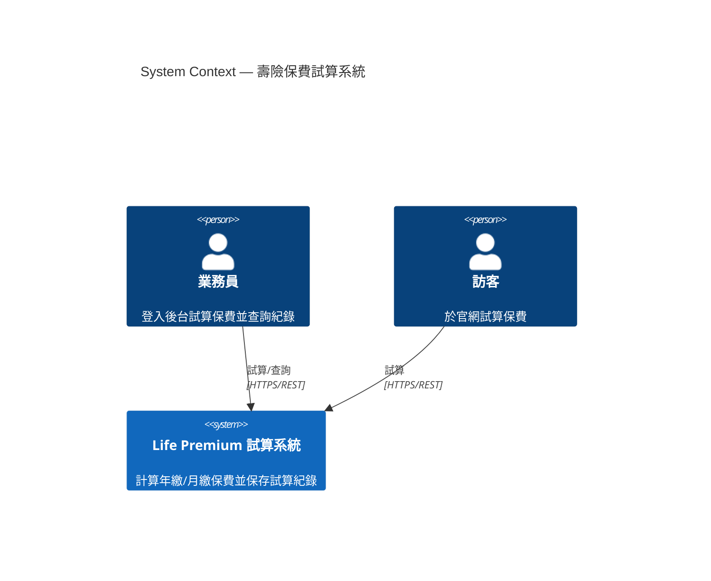
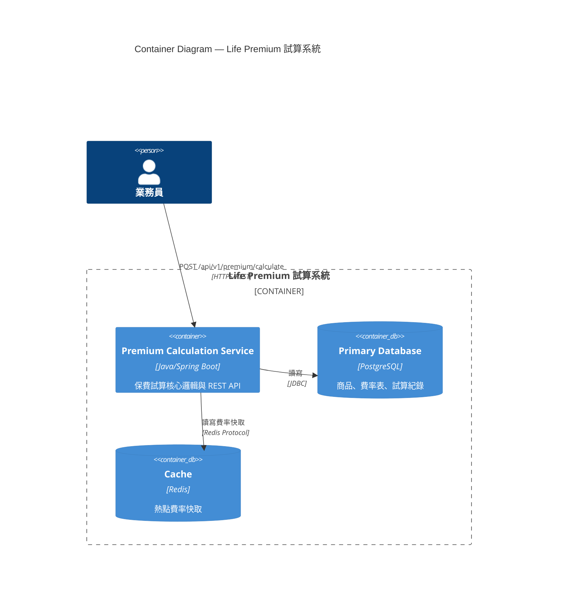
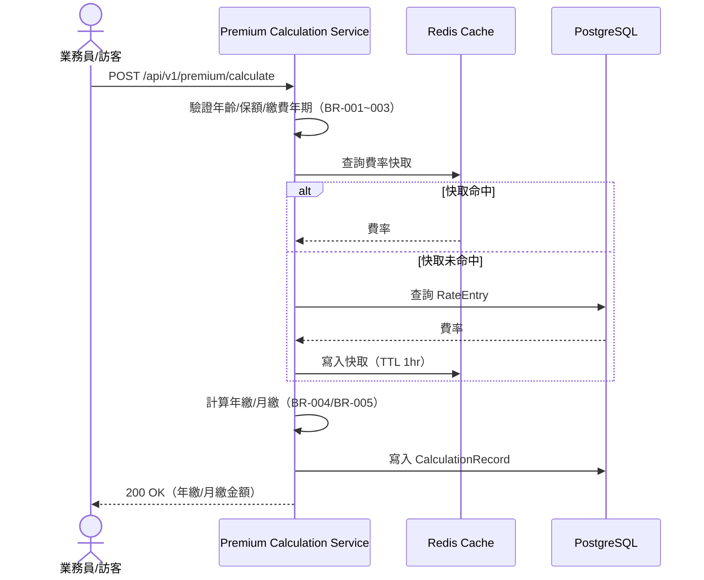

# 功能規格文件 (Functional Specification Document)

**文件編號：** FSD-LIFE-v1.0
**專案名稱：** 壽險新保件保費試算（Life Premium）
**版本：** v1.0　**建立日期：** 2026-09-08　**最後更新：** 2026-09-08
**文件狀態：** 核准（HITL 已於本次驗證流程確認 Phase 1 / Phase 2）

---

## 文件修訂紀錄

| 版本 | 日期 | 修訂人 | 修訂說明 |
|------|------|--------|----------|
| 0.1 | 2026-09-08 | GitHub Copilot（`generate-fsd`） | 初稿建立，依 LIFE-PREMIUM-requirements.md 產出 |
| 1.0 | 2026-09-08 | 架構師（HITL 確認） | Phase 1 / Phase 2 皆已確認，定稿 |

---

## 1. 文件目的與範圍

### 1.1 目的
本文件描述「壽險新保件保費試算」系統的功能需求，作為開發、測試與業務單位溝通基礎，
並作為後續系統設計（SD）與 TDD/BDD 程式碼產出的依據。

### 1.2 範圍
- 依被保人年齡、性別、保額、繳費年期，查表計算年繳與月繳保費
- 提供 REST API 供官網/業務員後台呼叫
- 保存試算紀錄供稽核

### 1.3 不在範圍內
- 保單核保、對保、收款等後續流程
- 多商品比較試算（本 MVP 僅支援 `LIFE-WL-01` 終身壽險單一商品）

---

## 2. 名詞定義與縮寫

| 名詞 / 縮寫 | 說明 |
|------------|------|
| FSD | Functional Specification Document，功能規格文件 |
| BR | Business Rule，業務規則編號 |
| 費率表（Rate Table） | 依年齡/性別/繳費年期查詢每千元保額費率的對照表 |

## 3. 參考文件

| 文件名稱 | 版本 | 說明 |
|----------|------|------|
| LIFE-PREMIUM-requirements.md | v1.0 | 業務需求來源 |

---

## 4. 系統概述

### 4.1 系統背景
壽險業務員或訪客需要在諮詢當下即時試算保費，協助客戶決策是否投保、選擇何種繳費年期。
過去以人工查表計算，容易出錯且耗時，因此建置線上試算服務。

### 4.2 系統目標
1. 提供準確且即時（≤500ms）的保費試算 API
2. 保存每筆試算紀錄供稽核與後續追蹤
3. 費率表可版本化更新，不影響歷史試算紀錄的可回溯性

### 4.3 使用者族群

| 使用者角色 | 說明 | 主要使用功能 |
|-----------|------|-------------|
| 業務員（Agent） | 登入後台系統的壽險業務員 | 保費試算、查詢試算紀錄 |
| 訪客（Guest） | 官網公開頁面使用者 | 保費試算（不查詢紀錄） |

---

## 5. 系統架構圖（C4 Model）

### 5.1 C4 L1 — System Context Diagram

### 5.2 C4 L2 — Container Diagram

**Container 清單：**

| Container | 技術選型 | 職責 |
|-----------|---------|------|
| Premium Calculation Service | Java 17 / Spring Boot 3.3 | 保費試算業務邏輯、REST API |
| Primary Database | PostgreSQL 15 | 商品、費率表、試算紀錄儲存 |
| Cache | Redis 7 | 費率表快取（Cache-Aside，TTL 1hr） |

---

## 6. 業務流程循序圖

### 6.1 保費試算（對應 FR-PREMIUM-001）

**例外情境：**
- 年齡/保額/繳費年期超出範圍 → 回傳 400（欄位驗證失敗）
- 查無對應費率 → 回傳 404（`RateNotFoundException`）

---

## 7. 功能需求

### 7.1 保費試算模組（PREMIUM）

#### FR-PREMIUM-001：保費試算

- **優先等級：** 高
- **需求來源：** LIFE-PREMIUM-requirements.md「業務情境」「核心業務規則」
- **功能描述：**
  使用者輸入商品代碼、被保人年齡、性別、保額、繳費年期，系統查詢對應費率並計算年繳與月繳保費。
- **前置條件：** 商品與對應費率表已建檔
- **主要流程：**
  1. 使用者送出試算請求（productCode, age, gender, insuredAmount, paymentPeriod）
  2. 系統驗證欄位是否符合 BR-001～BR-003
  3. 系統依 (productCode, age, gender, paymentPeriod) 查詢費率
  4. 系統依 BR-004 計算年繳保費，依 BR-005 計算月繳保費
  5. 系統保存試算紀錄並回傳結果
- **替代流程：** 無（訪客與業務員共用同一計算邏輯，差異僅在紀錄保存的來源標記）
- **例外處理：**
  - 年齡不在 0～70 歲 → `AgeOutOfRangeException`，回傳 400
  - 保額不在 100～5,000 萬元 → `AmountOutOfRangeException`，回傳 400
  - 繳費年期不在 {10,20,30,99} → `InvalidPaymentPeriodException`，回傳 400
  - 查無對應費率 → `RateNotFoundException`，回傳 404
- **驗收標準：**
  - [ ] 年齡 35 / 男性 / 保額 1000 萬 / 20 年期 / 費率 12.50 → 年繳 125,000、月繳 10,729
  - [ ] 年齡 71 歲 → 回傳 400
  - [ ] 保額 6,000 萬 → 回傳 400
  - [ ] 繳費年期 15 年（不在允許清單）→ 回傳 400
  - [ ] 查無費率組合 → 回傳 404

#### FR-PREMIUM-002：試算紀錄查詢

- **優先等級：** 中
- **需求來源：** 非功能需求「試算紀錄需保留供稽核」
- **功能描述：** 業務員可查詢自己過去的試算紀錄清單。
- **驗收標準：**
  - [ ] 業務員可依時間區間查詢自己的試算紀錄
  - [ ] 訪客無法查詢試算紀錄（401/403）

### 7.2 費率表管理模組（RATE）

#### FR-RATE-001：費率表版本管理

- **優先等級：** 中
- **需求來源：** 非功能需求「支援之後費率表版本更新，不可覆蓋歷史試算紀錄所依據的費率」
- **功能描述：** 費率表以版本（RateTableVersion）管理，新增版本不影響歷史試算紀錄的費率依據。
- **驗收標準：**
  - [ ] 新增費率表版本後，舊版試算紀錄仍可回溯原始費率

---

## 8. 非功能需求

### 8.1 效能需求

| 指標 | 目標值 |
|------|--------|
| API 回應時間 | ≤ 500 ms |

### 8.2 安全性需求
- 業務員 API 需驗證身份（`X-Agent-Id` / JWT，SD 階段決定）
- 試算紀錄查詢僅限業務員本人資料

### 8.3 可用性需求
- 系統可用性：99.5%

### 8.4 相容性需求

| 類別 | 規格 |
|------|------|
| 用戶端 | 官網前端（RWD）、業務員後台前端 |

---

## 9. 使用者介面需求

### 9.1 設計原則
- 本 MVP 聚焦後端 API，前端畫面不在本文件範圍內

### 9.2 畫面清單

| 畫面 ID | 畫面名稱 | 說明 | 關聯功能 |
|---------|---------|------|---------|
| SCR-001 | 保費試算頁 | 輸入被保人資料並顯示試算結果 | FR-PREMIUM-001 |

---

## 10. 資料需求

### 10.1 主要資料實體

| 實體名稱 | 說明 | 關聯實體 |
|---------|------|---------|
| Product | 保險商品（如 LIFE-WL-01） | RateTableVersion |
| RateTableVersion | 費率表版本 | Product, RateEntry |
| RateEntry | 單筆費率（年齡/性別/繳費年期 → 費率） | RateTableVersion |
| CalculationRecord | 試算紀錄 | Product, RateEntry |

### 10.2 資料保留政策
- 試算紀錄：永久保留供稽核

---

## 11. 整合需求

本 MVP 無外部系統整合需求。

---

## 12. 限制與假設

### 12.1 限制條件
- 僅支援單一商品 `LIFE-WL-01`

### 12.2 假設前提
- 費率表資料已由商品部門事先建檔

---

## 13. Gherkin 測試案例

### 13.1 Gherkin 撰寫規範
依 [.github/skills/generate-fsd/references/FSD-template.md](../../../.github/skills/generate-fsd/references/FSD-template.md) §13.1 規範撰寫。

### 13.2 保費試算 Feature

**檔案：** `sdlc/fsd/output/features/premium-calculation.feature`

（完整內容見同目錄下 `.feature` 檔）

### 13.3 Feature 清單

| Feature 檔案 | 對應模組 | Scenario 數 | 對應 FR |
|-------------|---------|------------|--------|
| `premium-calculation.feature` | 保費試算 | 6 | FR-PREMIUM-001 |

---

## 14. 審查與核准

| 角色 | 姓名 | 簽核日期 | 備註 |
|------|------|---------|------|
| 業務需求方 | 壽險商品部（代） | 2026-09-08 | HITL 確認 |
| 產品負責人 | 架構師（代） | 2026-09-08 | HITL 確認 Phase 1 + Phase 2 |
| 技術主管 | 架構師（代） | 2026-09-08 | |
| 品保主管 | — | — | 待 test-report/code-review 階段回饋 |

---

*本文件由 GitHub Copilot `generate-fsd` Skill 產生，版本控制請參考 Git 歷史紀錄。*
