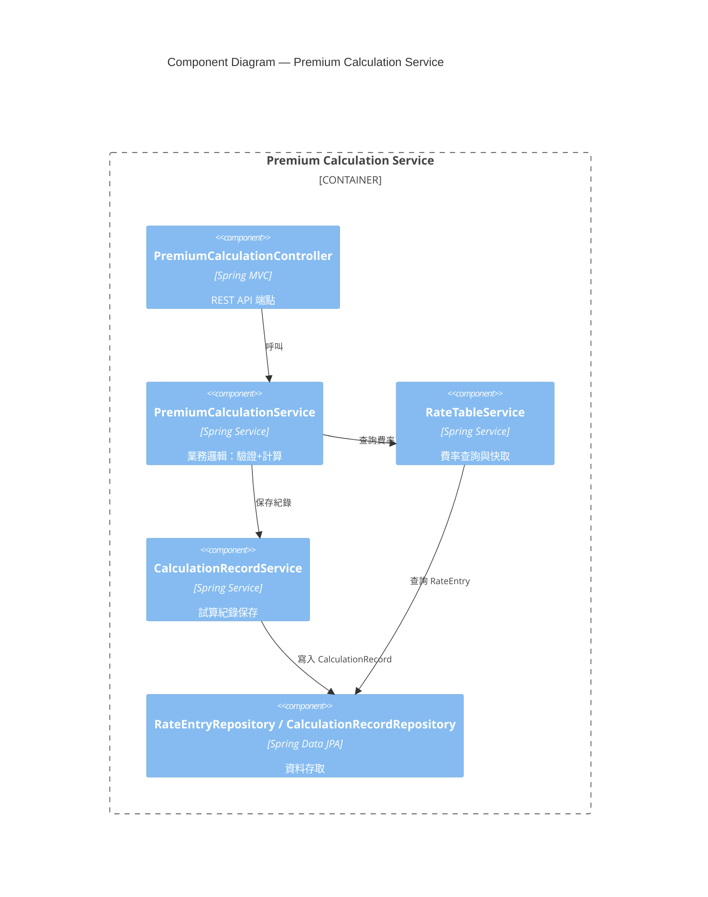
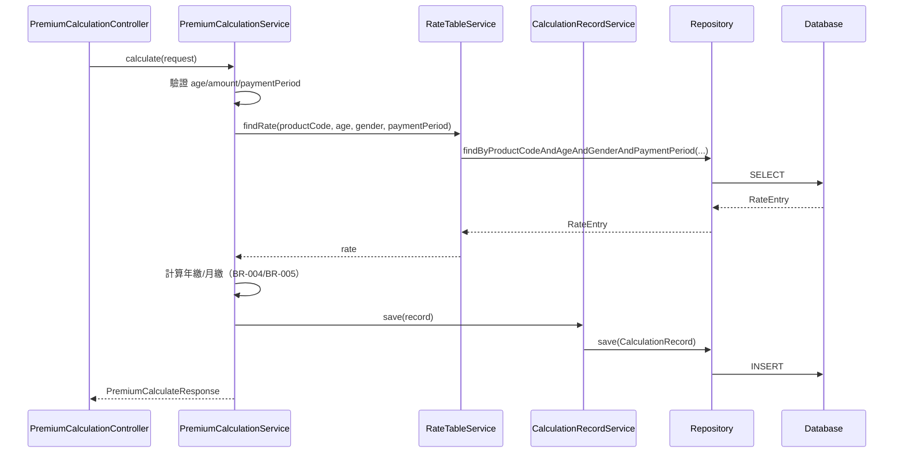

# 系統設計文件 (System Design Document)

**文件編號：** SD-LIFE-v1.0　**專案名稱：** 壽險新保件保費試算（Life Premium）
**版本：** v1.0　**建立日期：** 2026-09-08　**對應 FSD：** FSD-LIFE-v1.0

---

## 1. 文件目的
本文件描述壽險保費試算系統的技術實作設計，作為 `springboot-codegen` Skill 產出程式碼的直接依據。

## 2. 參考文件

| 文件名稱 | 版本 |
|----------|------|
| FSD-LIFE-v1.0 | v1.0 |

## 3. 架構概觀

### 3.1 架構風格
採 **Modular Monolith**（模組化單體），依 [ADR-0001](../../adr/output/ADR-0001-架構風格.md) 決定：
在單一 Spring Boot 應用內，以 package 邊界劃分模組（premium、rate、record），
簡化 MVP 階段的部署與維運複雜度，未來可依模組邊界拆分為獨立服務。

### 3.2 技術標準宣告

> ⚠️ 本節為 `springboot-codegen` 唯一的 package 命名依據。

| 項目 | 值 |
|------|-----|
| **Package Root** | `com.example.lifepremium` |
| Java 版本 | 17 |
| Spring Boot 版本 | 3.3 |
| 資料庫（正式環境） | PostgreSQL 15 |
| 資料庫（測試環境） | H2 In-Memory（相容模式：PostgreSQL）— 見 [ADR-0006](../../adr/output/ADR-0006-測試資料庫替代方案.md) |
| 快取 | Redis 7（正式環境）；測試環境停用快取，直接查 Repository |
| 建置工具 | Maven 3.9（含 wrapper） |

### 3.3 ADR 索引

| ADR | 決策主題 | 狀態 |
|-----|---------|------|
| [ADR-0001](../../adr/output/ADR-0001-架構風格.md) | 架構風格：Modular Monolith | Accepted |
| [ADR-0002](../../adr/output/ADR-0002-後端框架.md) | 後端框架：Spring Boot 3.3 + Java 17 | Accepted |
| [ADR-0003](../../adr/output/ADR-0003-資料庫選型.md) | 資料庫選型：PostgreSQL | Accepted |
| [ADR-0004](../../adr/output/ADR-0004-費率快取策略.md) | 費率快取策略：Redis Cache-Aside | Accepted |
| [ADR-0005](../../adr/output/ADR-0005-主鍵產生策略.md) | 主鍵產生策略：UUID | Accepted |
| [ADR-0006](../../adr/output/ADR-0006-測試資料庫替代方案.md) | 測試環境資料庫替代方案：H2 | Accepted |

---

## 4. C4 L3 元件圖



## 5. 技術層循序圖



## 6. 模組設計

| 模組 | 依賴 | 對應 FR |
|------|------|--------|
| premium（保費試算） | rate, record | FR-PREMIUM-001, FR-PREMIUM-002 |
| rate（費率表管理） | — | FR-RATE-001 |
| record（試算紀錄） | — | FR-PREMIUM-002 |

## 7. 資料設計

### 7.1 ER 概述
`Product` 1 對多 `RateTableVersion`；`RateTableVersion` 1 對多 `RateEntry`；
`CalculationRecord` 參照 `Product` 與實際使用的 `RateEntry`（保存費率快照以利歷史回溯）。

### 7.2 資料表定義

#### Product

| 欄位 | 型別 | 約束 | 說明 |
|------|------|------|------|
| id | UUID | PK | 主鍵 |
| product_code | VARCHAR(20) | UNIQUE, NOT NULL | 商品代碼，如 LIFE-WL-01 |
| product_name | VARCHAR(100) | NOT NULL | 商品名稱 |
| created_at / updated_at | TIMESTAMPTZ | NOT NULL | 稽核欄位 |

#### RateTableVersion

| 欄位 | 型別 | 約束 | 說明 |
|------|------|------|------|
| id | UUID | PK | 主鍵 |
| product_id | UUID | FK → product.id, NOT NULL | 所屬商品 |
| version_no | VARCHAR(10) | NOT NULL | 版本號，如 v1 |
| effective_date | DATE | NOT NULL | 生效日 |

**索引：** UNIQUE(product_id, version_no)

#### RateEntry

| 欄位 | 型別 | 約束 | 說明 |
|------|------|------|------|
| id | UUID | PK | 主鍵 |
| rate_table_version_id | UUID | FK, NOT NULL | 所屬費率表版本 |
| age | INT | NOT NULL, CHECK (age BETWEEN 0 AND 70) | 年齡 |
| gender | CHAR(1) | NOT NULL, CHECK (gender IN ('M','F')) | 性別 |
| payment_period | INT | NOT NULL, CHECK (payment_period IN (10,20,30,99)) | 繳費年期 |
| rate_per_thousand | NUMERIC(10,2) | NOT NULL | 每千元保額費率 |

**索引：** UNIQUE(rate_table_version_id, age, gender, payment_period)
**快取策略：** Cache-Aside，key = `rate:{productCode}:{age}:{gender}:{paymentPeriod}`，TTL = 1hr（見 ADR-0004）

#### CalculationRecord

| 欄位 | 型別 | 約束 | 說明 |
|------|------|------|------|
| id | UUID | PK | 主鍵 |
| product_id | UUID | FK, NOT NULL | 商品 |
| rate_entry_id | UUID | FK, NOT NULL | 使用的費率（快照參照） |
| agent_id | VARCHAR(64) | NULL | 業務員 ID（訪客為 NULL） |
| age / gender / payment_period | — | NOT NULL | 輸入參數快照 |
| insured_amount | BIGINT | NOT NULL | 保額（元） |
| annual_premium | BIGINT | NOT NULL | 年繳保費 |
| monthly_premium | BIGINT | NOT NULL | 月繳保費 |
| created_at | TIMESTAMPTZ | NOT NULL | 試算時間 |

**索引：** INDEX(agent_id, created_at)

## 8. API 設計

### 8.1 API 清單

| Method | Path | 說明 | 權限 |
|--------|------|------|------|
| POST | /api/v1/premium/calculate | 保費試算 | 公開（訪客/業務員皆可） |
| GET | /api/v1/premium/records | 查詢試算紀錄 | 需 `X-Agent-Id`（業務員） |

### 8.2 Request/Response Schema

**Request（`PremiumCalculateRequest`）：**
```json
{
  "productCode": "LIFE-WL-01",
  "age": 35,
  "gender": "M",
  "insuredAmount": 10000000,
  "paymentPeriod": 20
}
```

**Response（`PremiumCalculateResponse`，包在 `ApiResponse<T>` 中）：**
```json
{
  "code": "SUCCESS",
  "message": null,
  "data": {
    "annualPremium": 125000,
    "monthlyPremium": 10729
  },
  "timestamp": "2026-09-08T10:00:00+08:00"
}
```

### 8.3 錯誤碼表

| HTTP 狀態碼 | 錯誤碼 | 說明 |
|------------|--------|------|
| 400 | VALIDATION_ERROR | Bean Validation 欄位驗證失敗 |
| 400 | AGE_OUT_OF_RANGE | 年齡不在 0～70 歲 |
| 400 | AMOUNT_OUT_OF_RANGE | 保額不在 100～5,000 萬元 |
| 400 | INVALID_PAYMENT_PERIOD | 繳費年期不在 {10,20,30,99} |
| 404 | RATE_NOT_FOUND | 查無對應費率 |
| 401/403 | UNAUTHORIZED / FORBIDDEN | 缺少或無效的 `X-Agent-Id` |

## 9. 安全設計

- 認證方式：MVP 階段以 `X-Agent-Id` Header 標示業務員身份（簡化版，正式環境應改為 JWT，見待辦 ADR）
- RBAC：訪客僅可呼叫 `POST /calculate`；業務員可額外呼叫 `GET /records` 且僅能查詢自己的紀錄
- 輸入驗證：所有 Request DTO 使用 Bean Validation，防止不合法資料進入 Service 層

## 10. 部署架構

- 環境清單：dev / test（H2, 無 Redis）/ prod（PostgreSQL + Redis）
- 容器化：Docker（本次驗證環境無 Docker，故不產出實際映像，僅提供 Dockerfile 骨架，供後續 CI/CD 使用）
- CI/CD：GitHub Actions（`./mvnw test` → `./mvnw package` → 建置映像），非本次驗證範圍

## 11. 可觀測性
- 監控指標：API 回應時間、費率快取命中率、試算失敗率（依錯誤碼分類）

## 12. 效能與快取策略
- 費率查詢採 Cache-Aside，TTL 1 小時；測試環境（`test` profile）停用快取直接查 H2

## 13. 錯誤處理策略
- 統一由 `GlobalExceptionHandler`（`@RestControllerAdvice`）攔截 `BusinessException` 子類別，
  轉換為對應 HTTP 狀態碼與統一 `ApiResponse` 格式

---

*本文件由 GitHub Copilot `generate-sd` Skill 產生。*
